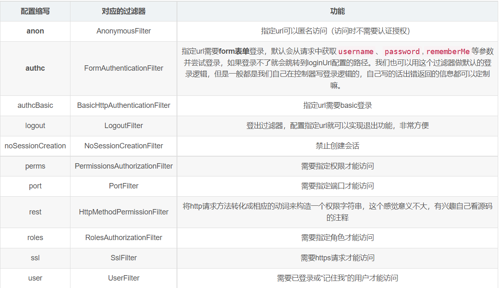

配置缩写	对应的过滤器	功能
anon	AnonymousFilter	指定url可以匿名访问（访问时不需要认证授权）
authc	FormAuthenticationFilter	指定url需要form表单登录，默认会从请求中获取username、password,rememberMe等参数并尝试登录，如果登录不了就会跳转到loginUrl配置的路径。我们也可以用这个过滤器做默认的登录逻辑，但是一般都是我们自己在控制器写登录逻辑的，自己写的话出错返回的信息都可以定制嘛。
authcBasic	BasicHttpAuthenticationFilter	指定url需要basic登录
logout	LogoutFilter	登出过滤器，配置指定url就可以实现退出功能，非常方便
noSessionCreation	NoSessionCreationFilter	禁止创建会话
perms	PermissionsAuthorizationFilter	需要指定权限才能访问
port	PortFilter	需要指定端口才能访问
rest	HttpMethodPermissionFilter	将http请求方法转化成相应的动词来构造一个权限字符串，这个感觉意义不大，有兴趣自己看源码的注释
roles	RolesAuthorizationFilter	需要指定角色才能访问
ssl	SslFilter	需要https请求才能访问
user	UserFilter	需要已登录或“记住我”的用户才能访问
